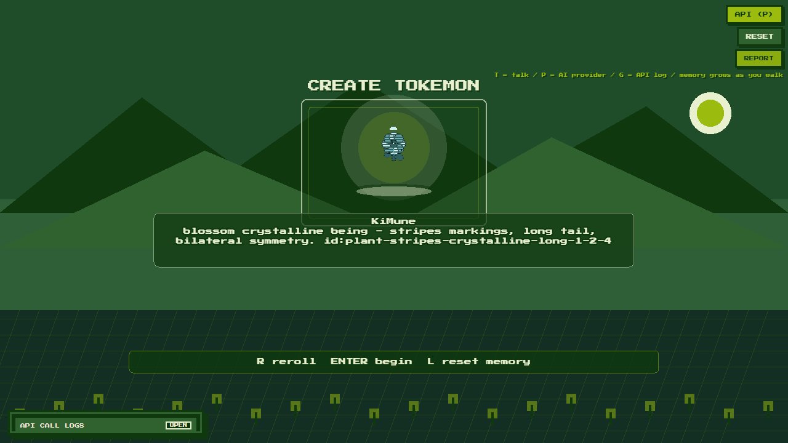
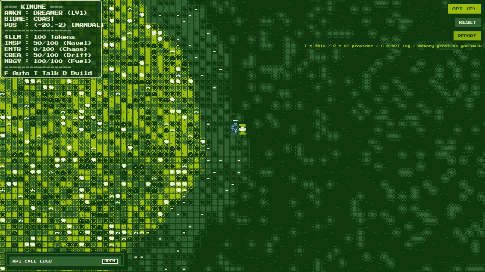

# Tokemons

**Tokemons** (CA: `TBxx1KPF4QDkZAtWsSGxVd9Jhv6ni4JBHKDUQaupump` - support fees go to creator) is a browser-based procedural companion adventure by **3esign**. It mixes a Game Boy-inspired world renderer, deterministic terrain sampling, generated creature bodies, local memory, and optional player-owned AI providers into a small playable slice.

Play it here: [tokemons.vercel.app](https://tokemons.vercel.app)



## Concept

Tokemons asks a simple question: what if a creature's personality grew from the places you explore together?

Every run begins with a generated Tokemon. Its genes produce a sprite, name, and description. The world is sampled from a seed and cell coordinates, so the same coordinates always produce the same terrain, props, and biome context. As you walk, talk, and build, the companion records memories and uses them as identity material.

The long-term idea is a living procedural field where exploration is not just movement. It becomes retrieval: coordinates become context, context becomes memory, and memory becomes a creature's self-story.

## Gameplay



Current playable loop:

- Generate and reroll a Tokemon on the creation screen.
- Enter an endless seeded world with biomes, props, ruins, roads, and buildable tiles.
- Move with a follower companion that records what it sees.
- Talk to the Tokemon through local or player-owned AI providers.
- Place simple build blocks and let those actions become part of memory.
- Continue from local save data, or reset memory and begin again.

## AI And Privacy

Tokemons does **not** ship with a shared production AI key.

Each player chooses their own provider in-game with **P**:

- Ollama or LM Studio for local models on the player's machine.
- OpenRouter, OpenAI, Groq, Together, DeepSeek, Mistral, or a custom OpenAI-compatible endpoint.
- Cloud API keys are stored in that player's browser, not committed to the repo.
- Tokemon memory is local save data owned by the player.

The Vercel `/api/chat` endpoint exists as a proxy path, but production is intentionally bring-your-own-key.

## Controls

| Key | Action |
| --- | --- |
| WASD | Move player and follower |
| T / C | Talk with your Tokemon |
| P | AI provider settings |
| G | API log |
| B | Toggle build mode |
| E | Place block ahead in build mode |
| 1 / 2 | Select house or path block |
| R | Reroll Tokemon on creation screen |
| ENTER | Begin adventure |
| L | Clear save/memory on creation screen |

## Architecture

Tokemons is a small npm workspace:

| Package | Purpose |
| --- | --- |
| `packages/client` | Vite + Phaser game, UI panels, save flow, rendering |
| `packages/kernel` | Deterministic world sampler, biomes, noise, cell contracts |
| `packages/tokemon-gen` | Tokemon genes, naming, and sprite baking |
| `api` | Vercel serverless chat proxy |
| `docs` | Architecture, deployment, content budget, roadmap notes |

Core rule: procedural world output comes from `worldSeed` and cell coordinates. World sampling should not depend on unseeded randomness.

## Roadmap

Planned improvements:

- Richer Tokemon generation: more body plans, palettes, animation poses, and evolution stages.
- More world verbs: inspect props, gather fragments, build larger structures, and discover landmarks.
- Better memory tools: visible journal, editable self-story, memory pruning, and export/import.
- Biome-specific encounters and events.
- Audio pass: restrained chiptune ambience and interaction sounds.
- Performance pass: chunked rendering, sprite batching, and optional code splitting.
- Deployment polish: custom domain, release screenshots, and a short gameplay trailer.

## Local Development

```bash
npm install
npm run dev
npm test
npm run build
npm run ci
```

The production build outputs the static client to `packages/client/dist`.

## Deployment

Vercel is configured from the repo root:

- Install: `npm ci`
- Build: `npm run build`
- Output: `packages/client/dist`

GitHub Pages is also supported through `.github/workflows/deploy-pages.yml`; see [docs/DEPLOYMENT.md](docs/DEPLOYMENT.md).

## Docs

- [Agent guide](AGENTS.md)
- [Architecture](docs/ARCHITECTURE.md)
- [Content budget](docs/CONTENT_BUDGET.md)
- [Master plan](docs/TOKEMONS_MASTER_PLAN.md)
- [Parametric graph spec](docs/PARAMETRIC_GRAPH_SPEC.md)
- [Deployment](docs/DEPLOYMENT.md)
