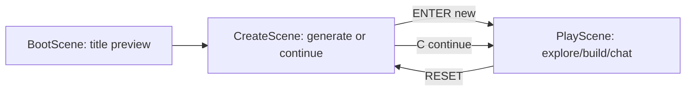

# Architecture

Tokemons is split into deterministic simulation packages and a browser client.

## Runtime Pieces

| Package | Responsibility |
| --- | --- |
| `@tokemons/kernel` | Seeded world sampling, biome classification, noise, and cell contracts. |
| `@tokemons/tokemon-gen` | Tokemon gene rolls, generated names/descriptions, and canvas sprite baking. |
| `@tokemons/client` | Phaser scenes, rendering, save/load, build mode, chat UI, and provider settings. |

## Scene Flow

## World Pipeline

1. `PlayScene.sync()` computes the live viewport size from the Phaser canvas.
2. `drawWorld()` asks `getCell()` for visible world cells.
3. `getCell()` converts world coordinates into chunk/local coordinates.
4. `sampleCell()` combines seeded elevation, moisture, temperature, weirdness, settlement, and vegetation fields.
5. The client renders biome color, ground detail, props, placed blocks, player, and Tokemon follower.

## Save And Memory

Browser storage key: `tokemons_save_v2`.

Saved runtime includes:

- world seed and player position
- generated Tokemon
- placed blocks
- mood
- episodic memory

Reset must clear save data and memory together.

## Publish Notes

The game is static after build. Hosted AI chat needs the Vercel API proxy or another compatible backend. GitHub Pages can host the static client, but cannot safely store hosted provider secrets.
