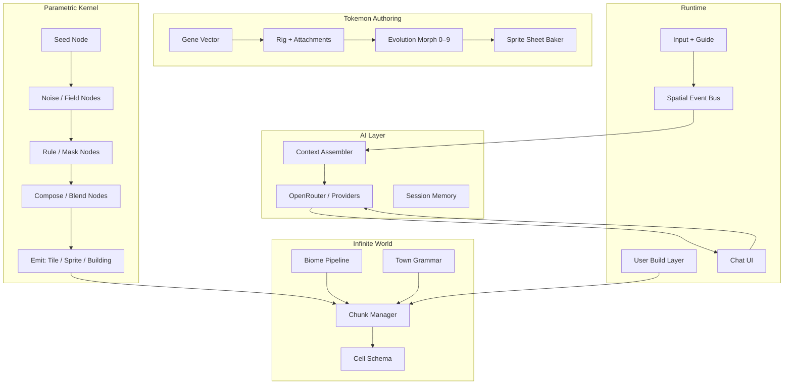

# Tokemons — Master Plan (Game Boy Era)

> **Vision:** An endless, seed-driven wilderness where every cell is unique, every Tokemon is procedurally authored, and AI (OpenRouter + providers) gives each companion a voice that reacts to where you go and what you do — all in a yellow-tinted, 4-shade Game Boy aesthetic with refined Japanese pixel-art discipline.

---

## 1. Design pillars

| Pillar | Rule |
|--------|------|
| **Determinism** | Same `(worldSeed, chunkX, chunkY, cellX, cellY)` → same terrain, props, wild spawns. |
| **Composability** | Every generator is a **parametric graph** (Grasshopper-style): nodes, wires, typed ports. |
| **Layered scale** | Macro (continent) → meso (biome) → micro (tile) → entity (sprite/building). |
| **Player agency** | Procedural world + **user-placed building blocks** + **guided movement** + **chat**. |
| **AI as soul, not geometry** | LLM handles dialogue, mood, narrative flavor; **never** breaks spatial determinism. |
| **Evolution as morph** | 10 stages = continuous parametric deformation + palette/shape unlocks, not 10 hand-drawn sprites. |

### Visual target (GB Yellow–inspired)

- **Resolution:** 160×144 logical (scale 3–4× with integer nearest-neighbor).
- **Palette:** 4 shades + optional warm yellow overlay (`#9BBC0F` family, desaturated for “high class” restraint).
- **Tile size:** 8×8 or 16×16 base grid; characters 16×16 or 16×24.
- **Motion:** 4-dir walk, 2-frame idle, battle pose separate sheet.
- **Reference mood:** Pokémon Red/Blue/Yellow readability, but **slightly abstracted** silhouettes and richer negative space (Japanese illustration discipline).

---

## 2. System map (high level)



---

## 3. Parametric kernel (Grasshopper-style)

Treat every procedural output as the result of a **DAG** (directed acyclic graph), serializable as JSON (`*.tokemongh`).

### 3.1 Core node types

| Category | Nodes (examples) |
|----------|------------------|
| **Sources** | `Seed`, `Constant`, `Coordinate2D`, `ChunkId` |
| **Fields** | `Perlin2D`, `Simplex2D`, `Worley2D`, `FBm`, `Ridged`, `DomainWarp` |
| **Math** | `Remap`, `Curve`, `Clamp`, `Lerp`, `Threshold`, `Posterize` |
| **Logic** | `Mask`, `If`, `SwitchBiome`, `RarityRoll` |
| **Structure** | `TilePicker`, `WFCConstraint`, `GrammarExpand` |
| **Sprite** | `RigTemplate`, `LimbAttach`, `PaletteMap`, `MorphStage` |
| **Emit** | `EmitTile`, `EmitProp`, `EmitWildTokemon`, `EmitBuilding` |

### 3.2 Execution model

1. **Compile** graph → ordered eval list (topological sort).
2. **Cache** per `(graphHash, contextHash)` for chunk bake.
3. **Context** carries: world seed, chunk coords, optional player influence radius.
4. **Hot reload** graphs in dev without rebuilding client.

### 3.3 GH files as resources

- Store reference graphs under `assets/graphs/` (world biome, tree, building module, tokemon body).
- Designer tweaks curves/thresholds in a visual editor (Phase 4+); MVP uses hand-authored JSON graphs.

---

## 4. Infinite world grid

### 4.1 Coordinates

- **World:** integer tile coords `(wx, wy)` — infinite in both axes.
- **Chunk:** e.g. `32×32` tiles → `chunkX = floor(wx/32)`, `chunkY = floor(wy/32)`.
- **Cell seed:** `hash(worldSeed, chunkX, chunkY, localX, localY, layerId)`.

### 4.2 Cell schema (minimal)

```ts
interface WorldCell {
  elevation: number;      // 0..1
  moisture: number;       // 0..1
  temperature: number;    // 0..1
  biomeId: BiomeId;
  terrainStyle: TerrainStyle;
  groundTileId: number;
  overlay?: PropRef;      // grass, flower, rock
  structure?: StructureRef; // tree, building, sign
  wildSlot?: WildSpawnRef;
  userDelta?: UserEdit;   // player-placed block overrides
}
```

### 4.3 Biome pipeline (macro → tile)

1. **Continent** — low-frequency FBM → land/ocean mask.
2. **Climate** — elevation + latitude proxy → temp/moisture fields.
3. **Biome classifier** — 2D lookup or decision tree → `biomeId`.
4. **Terrain style** — sub-noise within biome (e.g. forest_floor vs forest_dense).
5. **Props** — independent rolls per layer with **spatial clustering** (Worley for groves).
6. **Wild Tokemons** — table driven by biome + rarity tier + cell seed.

### 4.4 Terrain styles (starter set)

| Style | Ground | Overlays | Wild bias |
|-------|--------|----------|-----------|
| `meadow` | grass variants | flowers, shrubs | common low-level |
| `deep_forest` | dark grass | trees (clustered) | nature types |
| `coast` | sand / surf animation | shells, driftwood | water-adjacent |
| `mountain` | rock / snow line | boulders | rare, high level |
| `wetland` | mud / reeds | lily pads | amphibious bias |
| `urban_fringe` | path / curb | lamps, fences | civilized spawns |
| `town_core` | pavement | NPC slots, doors | no wild / scripted |

### 4.5 Procedural towns & cities

**Town** = grammar-generated layout on a reserved biome island:

```
TownRoot → MainStreet × N → Block → [House | Shop | Park | Plaza]
```

- **Lots** from Voronoi over town bbox; **roads** from MST or L-system on grid.
- **Buildings** = stack of **building blocks** (floor, wall, roof, door, window, sign) each block itself a small parametric graph.
- **City** = larger grammar + district tags (residential, commercial, industrial) with WFC for façade variety.
- **Blend** town edge into wilderness via `urban_fringe` biome transition (smooth threshold on distance-to-town-center field).

### 4.6 User building blocks

- **Catalog** of placeable modules (same block graphs as procedural buildings).
- **Persistence:** `userDelta` stored in chunk diff layer (local save / optional sync later).
- **Validation:** snap to grid, collision mask, biome permissions (e.g. no skyscraper in deep_forest without flag).

---

## 5. Tokemon procedural design system

### 5.1 Gene vector (authoring DNA)

```ts
interface TokemonGenes {
  bodyPlan: 'biped' | 'quadruped' | 'serpent' | 'floating' | 'plant' | 'mech';
  mass: number;           // 0..1
  limbCount: number;      // 0..8
  symmetry: 'bilateral' | 'radial';
  surface: 'smooth' | 'segmented' | 'fluffy' | 'crystalline';
  paletteHue: number;
  paletteSat: number;
  pattern: 'solid' | 'spots' | 'stripes' | 'gradient' | 'markings';
  aura: number;           // evolution late-stage glow
  personalitySeed: number; // AI tone, not visuals
}
```

### 5.2 Rig pipeline

1. Pick **body plan template** (skeleton JSON: bone hierarchy + attachment sockets).
2. **Procedural limbs** — length/thickness from genes + noise; cap with shape primitives (rounded rects, triangles).
3. **Surface pass** — pattern node applies spots/stripes in UV-like sprite space.
4. **Palette** — 4-color GB mapping from hue/sat + shade curve.
5. **Bake** — rasterize to 16×16 / 16×24 / 32×32 battle sheet.

### 5.3 Ten evolution stages (0 = base, 9 = apex)

Evolution is **not** 10 discrete drawings — one **morph parameter** `t ∈ [0,1]` mapped to stages `0..9`:

| Stage band | Visual change | Stat flavor |
|------------|---------------|-------------|
| 0–2 | size +1px, ear/horn nubs | HP growth |
| 3–5 | limb elongation, pattern complexity | speed / skill |
| 6–7 | secondary features (wings, tail fork) | type affinity |
| 8–9 | aura layer, silhouette prestige | rare ability unlock |

**Triggers:** XP, bonding (chat quality), spatial milestones (first town, biome set, user-built home).

### 5.4 Names & descriptions

- **Fast path:** template + syllable generator from `personalitySeed`.
- **Rich path:** LLM once at creation; cache in save data (don’t re-call per frame).

---

## 6. AI integration (OpenRouter + providers)

### 6.1 Separation of concerns

| System | Responsibility |
|--------|----------------|
| Procedural | Geometry, spawns, stats baselines |
| LLM | Voice, reactions, quest hints, battle banter |
| Spatial bus | Facts: biome, weather, nearby entities, last action |

### 6.2 Context packet (per chat turn)

```ts
interface TokemonContext {
  name: string;
  evolutionStage: number;
  mood: MoodVector;
  lastEvents: SpatialEvent[];  // capped ring buffer
  cellSummary: { biome, terrain, props };
  playerIntent?: string;
}
```

### 6.3 Spatial events → behavior

Examples: `entered_biome`, `wild_encounter_near`, `player_placed_block`, `stumbled`, `rested`, `rain_started`.

- Each event adjusts **mood/stats** deterministically.
- LLM receives events as natural language **after** numbers are computed.

### 6.4 Provider abstraction

```ts
interface LLMProvider {
  complete(messages: Message[], opts: ProviderOpts): Promise<string>;
}
// Implementations: OpenRouter, (later) Anthropic, local Ollama
```

---

## 7. Player loop (MVP → full)

1. **Boot** — world seed (random or code).
2. **Create Tokemon** — roll genes → bake sprite → name/description → pick starter biome safe zone.
3. **Explore** — guide avatar + Tokemon follower; chunks stream in.
4. **Interact** — bump props, talk to NPC slots, chat box anytime.
5. **Build** — toggle build mode, place blocks from catalog.
6. **Evolve** — on threshold, play morph animation, update sheet.

---

## 8. Tech stack (web-first)

| Layer | Choice | Why |
|-------|--------|-----|
| **Host** | **Vercel** and/or **GitHub Pages** | Static Vite build; zero server for game loop |
| Runtime | **TypeScript + Phaser 3** in browser | Fast 2D, tilemaps, GB pixel-art scale |
| Build | **Vite** (`packages/client`) | Fast HMR, `VITE_BASE_PATH` for Pages subpaths |
| Proc kernel | **Pure TS** (`@tokemons/kernel`) | Bundled into client; same logic as headless bake |
| Save | **IndexedDB** + JSON export | Chunk diffs + Tokemon save (no backend required) |
| AI | **OpenRouter** via **Vercel `/api/chat`** | API keys never shipped to the browser |

See [DEPLOYMENT.md](DEPLOYMENT.md) for Vercel vs GitHub Pages setup.

**Production pattern:** static game on Vercel or Pages; optional serverless chat only on Vercel.

---

## 9. Phased roadmap (slow build)

### Phase 0 — Foundation (2–3 weeks)
- [x] Web client scaffold (Vite + Phaser, Vercel + GitHub Pages)
- [x] GB palette, pixel-art scale
- [x] Seed + hash utilities, chunk coord math
- [ ] Parametric kernel: JSON graph loader (`.tokemongh` evaluator)
- [x] Debug overlay: biome false-color map (WASD pan, R reseed)

### Phase 1 — World that breathes (3–4 weeks)
- [ ] Cell schema + biome classifier pipeline
- [ ] Chunk load/unload + tile renderer
- [ ] 3 terrain styles (meadow, forest, coast)
- [ ] Vegetation props (trees, grass clusters)
- [ ] Player walk + camera follow

### Phase 2 — Tokemon v1 (3–4 weeks)
- [ ] 2 body plans, rig baker, 4-shade output
- [ ] Gene roll at start, syllable names
- [ ] Follower sprite + simple animation
- [ ] Evolution stages 0–3 only (morph t)

### Phase 3 — Interaction (2–3 weeks)
- [ ] Spatial event bus
- [ ] Chat UI + OpenRouter provider + context assembler
- [ ] Mood vector affecting dialogue tone

### Phase 4 — Settlement (3–4 weeks)
- [ ] Town grammar + building block library
- [ ] Urban fringe blending
- [ ] User place/remove blocks + chunk diff save

### Phase 5 — Depth (ongoing)
- [ ] Wild Tokemons + encounter tables
- [ ] Evolution 4–9 + aura
- [ ] Visual graph editor for designers
- [ ] Battle loop (GB-style menus) optional

---

## 10. Folder structure (target)

```
tokemons/
├── docs/                    # This plan + graph specs
├── packages/
│   ├── kernel/              # Parametric DAG evaluator
│   ├── world/               # Chunk, biome, town generators
│   ├── tokemon-gen/         # Rig, morph, sheet baker
│   └── client/              # Phaser game + UI
├── assets/
│   ├── graphs/              # *.tokemongh JSON pipelines
│   ├── palettes/            # GB yellow, grayscale variants
│   └── templates/           # Rig skeletons, building blocks
└── tools/
    └── bake-chunk.ts        # Headless chunk preview PNG
```

---

## 11. First concrete graphs to author

1. **`world_biome_base.tokemongh`** — continent + climate + biomeId  
2. **`terrain_meadow.tokemongh`** — ground tile + flower scatter  
3. **`tree_cluster.tokemongh`** — Worley grove + tree prop  
4. **`tokemon_body_biped.tokemongh`** — rig + limbs + palette  
5. **`evolution_morph.tokemongh`** — stage ← morph parameter  
6. **`town_block_house.tokemongh`** — modular façade  

---

## 12. Open decisions (pick before Phase 1 coding)

1. **Phaser vs Godot** — team comfort vs pure code pipeline  
2. **AI proxy** — browser direct (dev only) vs tiny backend  
3. **Tile size** — 8×8 classic vs 16×16 detail  
4. **Multiplayer** — defer; design chunk diff format as if sync later  

---

## 13. Success criteria for “vertical slice 1”

- Walk endlessly in one seed; chunks match on reload.  
- See 3 biomes blend naturally.  
- One procedural Tokemon follows you; chat responds with biome-aware flavor.  
- Place one building block; it persists in that chunk.  

---

*Next step:* implement **Phase 0** — `packages/kernel` with `Seed`, `Perlin2D`, `Remap`, `EmitTile` and a debug biome map renderer.
