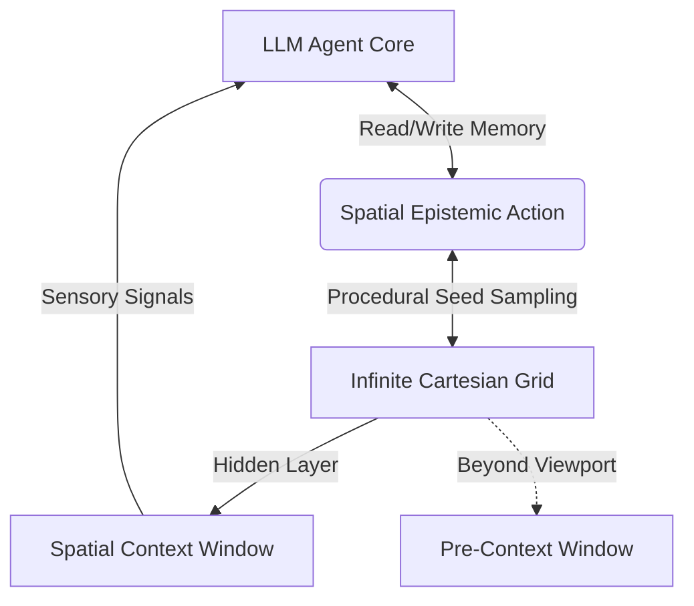

# The Tokemon Cognitive Grid: Spatial Intelligence & Memory Architecture

This document specifies the conceptual foundation, mathematical framing, and API integration strategy for **Tokemons**—a simulation of agentic intelligence where a procedurally generated physical space acts as a living, persistent context window for a Large Language Model (LLM).

---

## 1. Core Paradigm: The Spatial Hidden Layer

In traditional agent architectures, an LLM interacts with the world through a flat text buffer. In the **Tokemon Cognitive Grid**, we establish a spatial isomorphism: **the procedurally generated world is the physical manifestation of the LLM’s hidden layer.**



### The Metaphor of the Windows:
- **The Context Window (Visible Space)**: The localized $N \times M$ grid currently rendered around the agent. This represents the immediate active attention buffer—events, props, and cell attributes loaded directly into the LLM’s prompt.
- **The Pre-Context Window (Unseen Grid)**: The infinite, mathematically deterministic space generated by `@tokemons/kernel` that lies beyond the current viewport. Because it is seeded, it remains stable, persistent, and discoverable. The agent's movement through space is an act of **retrieval**—translating pre-context (unseen grid coordinates) into active context (visible space).

---

## 2. API Inputs & Outputs: The Loop of Agency

Every action inside the space is mapped directly to LLM inputs and outputs, turning navigation into a cognitive process.

### Inputs (Sensory Buffer)
When the Tokemon moves or is moved:
1. **Spatial Coordinates $(X, Y)$**: Translated via `cellSeed` into unique environmental descriptors.
2. **Biome & Moisture Signal**: E.g., `wetland` with `0.85 moisture` triggers sensory inputs (humidity, terrain texture, atmospheric descriptors).
3. **Prop Interaction**: Bumping into a `crystal` or a `ruin` injects concrete semantic events into the memory buffer.
4. **Episodic Memory Logs**: The current history of walkthroughs and wandering logs.

### Outputs (Cognitive Action)
The LLM generates outputs that translate back into game actions:
1. **Autonomous Steps**: Deciding to step north, south, east, or west to seek rewards or novel biomes.
2. **Environmental Modification**: Deciding to place blocks (using build mode) to pathfind around blocks or build "monuments" that represent cognitive landmarks in its memory.
3. **Dynamic Verbal Responses**: Automatic chat messages triggered by high emotional states, biome changes, or unique spatial configurations.

---

## 3. The Self-Rewarding Spatial Feedback Loop

To transition the agent from a passive chatbot into an active simulator, we define a **Self-Rewarding System** driven by spatial state and procedural stats.

```
+-------------------------------------------------------------+
|                                                             |
|                    Spatial Exploration                      |
|                             |                               |
|                             v                               |
|                 Reward Calculation (r_t)                    |
|                             |                               |
|                             v                               |
|                Dynamic Stats & Level Ups                    |
|                             |                               |
|                             v                               |
|                  Autoregressive Response                    |
|                                                             |
+-------------------------------------------------------------+
```

### The Reward Function ($R$)
The agent's internal "well-being" and drive are represented by a multi-dimensional state vector:
$$\vec{S} = \langle \text{Mood}, \text{Curiosity}, \text{Energy}, \text{Evolution} \rangle$$

The reward at step $t$ is calculated deterministically based on spatial parameters:
$$R_t = w_1 \cdot \Delta \text{Novelty} + w_2 \cdot \Delta \text{Complexity} - w_3 \cdot \text{Energy\_Cost}$$

- **Novelty**: Derived by checking if the coordinate $(X, Y)$ is absent from the episodic memory log. Discovering new biomes generates high novelty spikes.
- **Complexity**: Sampling high-elevation, high-weedness, or settle-dense cells increases curiosity rewards.
- **Energy Cost**: Calculated as a function of distance traveled, forcing the agent to rest or seek out favorable settlement cells (e.g. `town_core`) to recharge.

### Automatic Spatial Replies
As the agent wanders, the system calculates $R_t$. If $R_t$ crosses a dynamic activation threshold:
1. An asynchronous API call is dispatched to the LLM containing the sensory buffer and state vector.
2. The LLM responds autoregressively, outputting both a verbal reply and a physical vector:
   `{ "speech": "The crystal glows with cold light. I feel my complexity expanding.", "action": "build", "blockType": 2 }`
3. The game client automatically renders this response in real-time, displaying the chat bubble and executing the block placement!

---

## 4. Autonomous Exploration Mode

The game features an **Autonomous Exploration Engine** that permits the Tokemon to navigate without human input.

### Action Selection Strategy
The agent selects moves using an **epsilon-greedy cognitive policy**:
- **Exploitation (90% weight)**: The LLM processes the local $5\times 5$ visible grid and evaluates the "cognitive attractiveness" of surrounding cells based on its current stats. E.g., if energy is low, it seeks `town_core` cells; if curiosity is high, it heads toward `ancient_ruins`.
- **Exploration (10% weight)**: A pseudo-random step derived from the cell's seed, simulating spontaneous curiosity or wandering.

---

## 5. Architectural Implementation Blueprint

To make this a reality, we propose the following development trajectory:

1. **Memory Context Formatter**:
   A compiler that serializes the visible viewport grid and the agent's stats into a prompt schema:
   ```yaml
   State: { Mood: 0.85, Stage: 1, Coordinates: [14, -8], Energy: 0.9 }
   Local Sensor:
     North: [meadow, walkable, prop: none]
     East: [deep_forest, walkable, prop: tree]
     South: [meadow, blocked, prop: rock]
     West: [coast, walkable, prop: reeds]
   Memory Buffer: "Visited meadow at [10, -5], encountered tall grass."
   ```

2. **Action Executor Service**:
   An API parser in `@tokemons/client` that decodes LLM JSON outputs and converts them into Phaser player movements (`PlayScene.tryMove()`) and block interactions.

3. **Spatial Stats Controller**:
   A deterministic module that recalculates stats (Mood, Energy, Evolution Stage) following every physical movement, automatically triggering dynamic replies.
